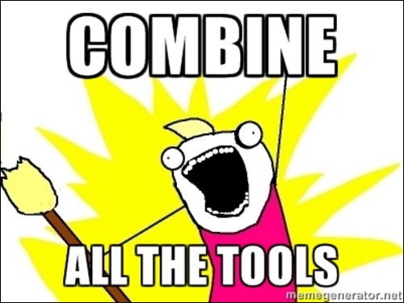
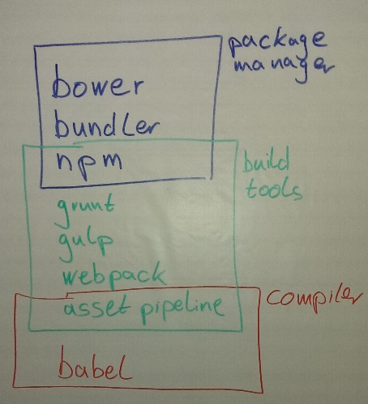

title: Asset Pipeline - Modern Frontend Development
author:
  name: Carsten Lamm
  github: https://github.com/FQ400
  url: http://www.kontextr.com
output: basic.html
--

# Asset Pipeline
## Modern Frontend Development

--

### table of content

1. background  
1. frontend definition
1. asset pipeline?
1. motivation  
1. tools

--

### my background

- started with Rails 2 up to Rails 3 (~3 years)
- **S**ingle **P**age **A**pplications using REST-APIs
  - AngularJS (~2 year)
- node and React (~1 year)
- now back to Rails 4

--

### Frontend Development means ...

... building web applications with UI  
... for mobile/desktop devices with/without touch  
... with different screen resolutions.

... also use build tools to optimize performance.  

... automatically test your code and layouts.  

... tracking and AB-Tests.  
...

--

### Asset Pipeline ...

... is a mighty building tool  
... which combines and compresses assets.  

... super integrated into Rails via gem.  

... produces assets marked with hashes.  
...

--

### motivation ;)

--

### some tools

[node](https://nodejs.org/en/) - Javascript on the server  
[npm](https://www.npmjs.com/) - Node Package Manager including package.json  
[grunt](http://gruntjs.com/) - Asset build tool - JSON based  
[gulp](https://github.com/gulpjs/gulp/blob/master/docs/getting-started.md) - Asset build tool - stream based  
[bower](http://bower.io/) - Package Manager for Javascript & CSS libs  
[webpack](https://webpack.github.io/) - Asset build tool - works fine with babel/ES2015  
[EcmaScript 2015](https://github.com/lukehoban/es6features) - latest Javascript, needs to be transpiled (source-to-source)  
[babel](https://babeljs.io/) - Javascript compiler for ES2015  
[bundler](http://bundler.io/) - Ruby Package Manager  
[Asset Pipeline](http://guides.rubyonrails.org/asset_pipeline.html) - Asset build tool - sprocket based  

--

### grouped tools

--

### kind of web app

- API/multiple clients - SPA
- (no) API/one client
- enterprise app
- small website
- progressive enhancement VS graceful degradation

--

### progressive enhancement

- page works without Javascript
- javascript make it more useable
  - date-input => fancy-datepicker

- bundler for ruby dependencies
- (bower for CSS/JS dependencies) => [rails-assets.org](rails-assets.org)
- asset pipeline pack

combine:

Asset Pipeline

--

 -> maybe Progressive Enhancement

ES6 ??? it can pack
Modules? Needed?
--

## kontextR

--
### Sources

[Wiki Compiler](https://en.wikipedia.org/wiki/Source-to-source_compiler)  
[Standard ECMA-262 6th Edition / June 2015](http://www.ecma-international.org/ecma-262/6.0/)  
[Cleaver](https://www.npmjs.com/package/cleaver)  
[Sprocket](https://github.com/rails/sprockets)  
[Progressive Enhancement](https://en.wikipedia.org/wiki/Progressive_enhancement)
[Graceful Degradation](https://en.wikipedia.org/wiki/Fault_tolerance)
